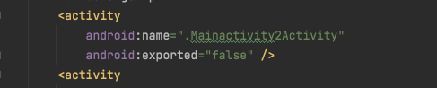
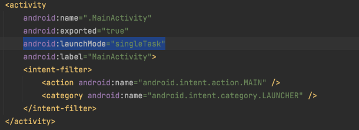
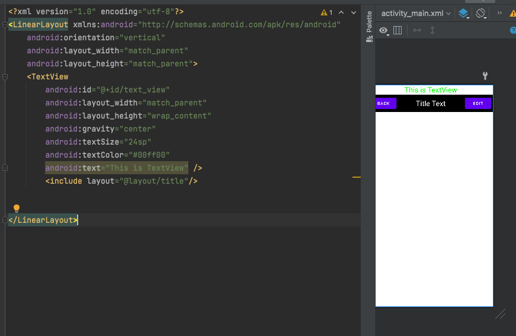

# 1. 布局


这是一个项目简单框架，然后在```main```里的kt代码文件内容就是如下

```kotlin
package com.example.demo

import android.support.v7.app.AppCompatActivity
import android.os.Bundle

class MainActivity : AppCompatActivity() {
//    override fun onCreate(savedInstanceState: Bundle?) {
//        super.onCreate(savedInstanceState)
//        setContentView(R.layout.demolayout)
//    }
    override fun onCreate(savedInstanceState: Bundle?) {
        super.onCreate(savedInstanceState)
        setContentView(R.layout.activity_main)//内容即是~/项目目录/app/src/main/res/layout/里面xml里文件的名称
    }
}
```

可以调用

``````kotlin
    override fun onCreate(savedInstanceState: Bundle?) {
        super.onCreate(savedInstanceState)
        setContentView(R.layout.名称)//内容即是~/项目目录/app/src/main/res/layout/里面xml里文件的名称
    }
``````

来选择自己想要的布局。

## 1.1 [textview](https://developer.android.com/reference/android/widget/TextView?hl=en)

```xml
    <TextView
        android:id="@+id/textView"
        android:layout_width="wrap_content"
        android:layout_height="wrap_content"
        android:text="@string/textview"
        android:textColor="#33691E"
        tools:layout_editor_absoluteX="16dp"
        tools:layout_editor_absoluteY="100dp"
        />
```

`android:id`是唯一表示的组件id，`android:layout_width，android:layout_height`是长宽的设置，`android:text`文本的设置，其中值`“@string/textview"`代表了文件目录下`main/res/values`中`string`里面`textview`值。

## 1.2 [ImageView](https://developer.android.com/reference/android/view/ViewGroup.LayoutParams)

首先遇到的一个问题是，在`main/layout/demo.xml`中简单添加了`imageView`	组件，但是却没有任何显示，然后发现一个属性`android:src="@drawable/my_image"`跟据上面`“@string/textview"`寻找值的经验，那么就把图片直接放入`drawable`目录里面，然后直接赋值`android:src="@drawable/background"`即可。

```xml
<ImageView
    android:layout_width="wrap_content"
    android:layout_height="wrap_content"
    android:src="@drawable/background"
    android:contentDescription="@string/text"
    />
```

发现问题是imageview不能全屏，那么是`android:layout_width` 和`android:layout_height`这两个设置的问题，然后查阅[android手册](https://developer.android.com/reference/android/view/ViewGroup.LayoutParams)得

| Constant     | Value    | Description                                                  |
| :----------- | :------- | :----------------------------------------------------------- |
| fill_parent  | ffffffff | The view should be as big as its parent (minus padding). This constant is deprecated starting from API Level 8 and is replaced by `match_parent`. |
| match_parent | ffffffff | The view should be as big as its parent (minus padding). Introduced in API Level 8. |
| wrap_content | fffffffe | The view should be only big enough to enclose its content (plus padding). |

所以修改成`fill_parent`即可。

## 1.3 Button

## 1.4 [EditText](https://developer.android.com/reference/android/widget/EditText?hl=en)

```xml
<EditText
    android:id="@+id/plain_text_input"
    android:layout_height="50dp"
    android:layout_width="100dp"
    android:inputType="text"
    android:hint="请输入密码"/>
```

最需要注意的就是要固定`layout_height`和`layout_width`，这里自己尝试了一下就直接取值了，这样是一个输入框，并且密码的话，可以加入`hint`而不是`text`，`text`会被删掉。

## 1.5 [CheckBox](https://developer.android.com/guide/topics/ui/controls/checkbox?hl=zh-cn)

```xml
<CheckBox android:id="@+id/checkbox2"
    android:layout_width="wrap_content"
    android:layout_height="wrap_content"
    android:text="@string/checkbox2"
    android:onClick="onCheckboxClicked"/>
```

`android:onClick`是新出现可方法，应在相应的`activity`中声明，所以在`main.kt`中加入

```kotlin
class MainActivity : AppCompatActivity() {
    fun onCheckboxClicked(view: View) {//相应的加入的函数，名称要和xml对应
        if (view is CheckBox) {
            val checked: Boolean = view.isChecked
            when (view.id) {
                R.id.checkbox1 -> {
                    if (checked) {//更改后可以得知状况
                        println("clicked")
                    } else {
                        println("noclicked")
                    }
                }
            }
        }
    }
    override fun onCreate(savedInstanceState: Bundle?) {
        super.onCreate(savedInstanceState)
        setContentView(R.layout.demolayout)
    }
}
```

## 1.6 ProgressBar

分成两种`ProgressBar`，一种是`Indeterminate Progress`，另一种是`Determinate Progress`


# 2. RecyclerView

# 3. [Activity](https://developer.android.com/guide/components/activities/activity-lifecycle)

## 3.1 [intent](https://developer.android.com/reference/android/content/Intent)

`Intent` 是在相互独立的组件（如两个 activity）之间提供运行时绑定功能的对象。他也可以在广播，服务之间进行通信


##

3.1 onCreat()

# XML
## 什么是xmlns 
其实`xmlns`是`XMLnamespace`


# 运行
1. 在AndroidManifest一开始是没有`mainactivity`也就是说他不知道要启动哪一个activity,如果加上了
```xml
<intent-filter>
    <action android:name = "android.intent.action.MAIN"/>
    <category android:name = "android.intent.category.LAUNCHER"/>
</intent-filter>
``` 

就可以运行了。

新建activity,andriod stdio会自动帮忙在`AndroidManifest.xml`里注册
### intent
两个活动要依靠`intent`,`intent`作用于服务，广播，这里先讲活动
操作是创建一个`Intent`，然后当前活动`startActivity(Intent)`
显式`intent`
```kotlin
button.setOnClickListener {

    val intent = Intent()
    intent.setClass(this, Mainactivity2Activity::class.java)//知识盲点
    startActivity(intent)
}
```
隐式`intent`
```xml
<activity
    android:name=".Mainactivity2Activity"
    android:exported="true"
    android:label="Mainactivity2Activity">
    <intent-filter>
        <action android:name="com.example.activitytest.ACTION_START"/>
        <category android:name="android.intent.category.DEFAULT"/>
    </intent-filter>
</activity>
```
注意，在`intent`构造的时候，必须被唤醒的`activity`的标签中，`action`和`category`必须和intent一样，如果构造`intent`不给第二个`category`那么这个`intent`的`category`默认值是`"android.intent.category.DEFAULT"`
**同时注意结构**
```kotlin
button.setOnClickListener {
    val intent = Intent("com.example.activitytest.ACTION_START")
    startActivity(intent)
}
```
```kotlin
button.setOnClickListener {
    val intent = Intent(Intent.ACTION_VIEW);
    intent.setData(Uri.parse("http://www.baidu.com"))
    startActivity(intent)
}
```
这是指定了`Intent`的`action`是`Intent.ACTION_VIEW`,是一个Android系统的内置动作，常量值为`android.intent.action.VIEW`。然后通过`Uri.parse()`的方法，将字符串解析然后把`Intent`的`setData()`方法传进去`Uri`对象传递进去。
### 生命周期
当最开始的时候是启动，`creat`后先`start`和`resume`

然后第二次点击，就发现第二个`activity`已经把第一个`activity`完全遮住，所以第一个`pause`和`stop`都会调用，
这次然后再次点击安卓的返回键，又发现了第一个`activity`是先`restart`，然后是`start`和`resume`这两个常规流程
如果没有被完全遮盖，那么只有`pause`然后恢复的时候是只有`resume`
### 启动模式
四种，分别是`standard`,`singleTop`,`singleTask`,`singleInstance`,可在`AndroidManifet.xml`中通过给<activity>指定`android:launchMode`属性来选择启动模式。
#### 1、standard
标准的，即他不管返回栈顶中有多少个自己的`activity`，如果你让他创建，他会一直创建，然后返回键也要按相应次数。不合理，因为本来就在栈顶了，还创建，没有意义，一个就够了。
#### 2、singleTask
修改
他这个是如果发现栈里没有新创建的`activity`那么就新创建，如果有了，那么直接把所有在之前的我的上面的`pop`掉。
#### 3、singleTop
如果发现栈顶是本身，就不会创建，如果2 -> 1,然后1 -> 2，如果发现`top`和新创建的不一样，还是会创建并且入栈
#### 4、singlestance

这里是给`SecondActivity`设置了`singlestance`所以到了另一个栈，如果从1->2->3那么在3按`back`的时候会到`1`，然后才会到`SecondActivity`。

### ActivityCollector
我们通过一个`List`来暂存活动，`addActivity()`添加活动，`removeActivity()`用于从`List`中移除活动，最后提供了一个`finish()`全部销毁。

# UI
### 1
一种比较简单的自定义view，首先自己写出相应的`xml`

然后再添加一句话，就是`<include layout="@layout/xxxx"/>`

### 2
#### 2.1
如果要响应事件修改属性，那么就要暴露接口，用自定义控件的方式解决。
最简单的一种形式，就只需要创建一个类然后`inflate`引入就好了。    
```kotlin
class TitleLayout  : LinearLayout {
    constructor(context: Context):super(context) {
        TitleLayout(context, null);
    }
    constructor(context: Context, attrs: AttributeSet?):super(context, attrs) {
        LayoutInflater.from(context).inflate(R.layout.title, this)
    }
}
```
#### 2.2
如果要暴露属性让别人可以修改，

首先要在`res/values`里创建`attrs.xml`,当`inflate`完后提取出来所要修改的`view`和所要赋值属性的值，然后进行所需要的修改。
```kotlin
LayoutInflater.from(context).inflate(R.layout.title, this)
var title_back: Button = findViewById(R.id.title_back)
val typedArray = context.obtainStyledAttributes(attrs, R.styleable.TitleLayout)
val title_back_content : String? = typedArray.getString(R.styleable.TitleLayout_back);
title_back.setText(title_back_content)
```

## ListView
数组中的数据无法传递给`ListView`所以借助适配器完成，然后用了`ArrayAdapter`适配器，`ArrayAdapter`构造函数要传入上下文和子项布局的`id`,以及要适配的数据，`android.R.layout.simple_list_item_1`这是一个安卓内置布局文件，里面只有一个`textview`,然后修改适配器就可以了。
```kotlin
class MainActivity : AppCompatActivity() {
    val array = Array(5, { i -> i * i * i})
    override fun onCreate(savedInstanceState: Bundle?) {
        super.onCreate(savedInstanceState)
        setContentView(R.layout.activity_main)
        var mDatas: ArrayAdapter<String> = ArrayAdapter<String>(this, android.R.layout.simple_list_item_1)//
        for(index in array.indices) {
            mDatas.add(index.toString())
            Log.d("oooooooo", index.toString())
        }
        var listView :ListView= findViewById(R.id.list_view);
//        var titleLayout:TitleLayout = findViewById(R.id.titleLayout)
//        listView.addView(titleLayout)
        listView.adapter = mDatas;
    }
}

```

## RecyclerView
如果要用`RecyclerView`那么要在`build.gradle`中添加相应的依赖库，


# fragment
其实每个`fragment`可以理解成自定义的组件，也是载入`xml`，不过是直接在`layout`里写，可以发现`main_activity`里不需要写哪一个`fragment`,而是在`xml`里写好了。

```kotlin
override fun onCreate(savedInstanceState: Bundle?) {
    super.onCreate(savedInstanceState)
    setContentView(R.layout.activity_main)
    var button = findViewById<Button>(R.id.button)
    button.setOnClickListener(object: View.OnClickListener {
        override fun onClick(v: View) {
            when (v.getId()) {
                R.id.button -> {
                    Log.d("????", "click: ")
                    replaceFragment(AnotherRightFragment());
                }
            }
        }
    });
}
```
```kotlin
private fun replaceFragment(fragment: Fragment) {
    val fragmentManager:FragmentManager = getSupportFragmentManager();//获取一个FragmentManager
    val transaction:FragmentTransaction = fragmentManager.beginTransaction()//然后开启一个事物
    Log.d("????", "replaceFragment: ")
    transaction.addToBackStack(null)//添加到返回栈，所以按back键就是对应的返回了。
    transaction.replace(R.id.right_layout, fragment)//
    transaction.commit()
}
```

这是`Button`的跳转
```kotlin
button.setOnClickListener(object: View.OnClickListener {
    override fun onClick(v: View) {
        when (v.getId()) {
            R.id.button -> {
                Log.d("????", "click: ")
                replaceFragment(AnotherRightFragment());
            }
        }
    }
})
```


# 广播
- 标准广播`Normal broadcasts`是一种完全异步执行的广播，在广播发出后，所有的广播接收器几乎都会在同一时刻接收到这条广播消息，没有先后顺序，效率高，但是无法被截断。

- 有序广播`Ordered broadcasts`是同步执行的广播，在广播发出后，同一时刻只有一个广播接收器接收，相当于是接收者排队接收，并且先接收的还可截断。

## 广播注册
### 一、在代码中注册（动态注册）
[demo]()
动态注册用
```kotlin
class MainActivity : AppCompatActivity() {
    lateinit private var intentFilter: IntentFilter//lateinit是指后面对他进行初始化。
    lateinit private var networkChangeReceiver: NetworkChangeReceiver
    override fun onCreate(savedInstanceState: Bundle?) {
        super.onCreate(savedInstanceState)
        setContentView(R.layout.activity_main)
        intentFilter = IntentFilter()
        intentFilter.addAction("android.net.conn.CONNECTIVITY_CHANGE")
        networkChangeReceiver = NetworkChangeReceiver()
        registerReceiver(networkChangeReceiver, intentFilter)
    }
    override fun onDestroy() {
        super.onDestroy()
        unregisterReceiver(networkChangeReceiver);
    }
    class NetworkChangeReceiver : BroadcastReceiver() {
        override fun onReceive(context: Context?, intent: Intent?) {
            var connectivityManager: ConnectivityManager? =
                context?.getSystemService(Context.CONNECTIVITY_SERVICE) as ConnectivityManager?//这个方法基于context,只有
            var networkInfo : NetworkInfo? = connectivityManager?.activeNetworkInfo;
            if (networkInfo != null && networkInfo.isAvailable) {
                Toast.makeText(context, "network isAvailable", Toast.LENGTH_SHORT).show()
            } else {
                Toast.makeText(context, "network isNotAvailable", Toast.LENGTH_SHORT).show()
            }
        }
    }
}
```
效果是，每当有网络切换时，`BroadcastReceiver`就会收到消息，消息种类是`intentFilter`加进去的，启用这个`Receiver`就可以，但是网络这种要有`Android`权限，在`AndroidManifest.xml`里加上`<uses-permission android:name="android.permission.ACCESS_NETWORK_STATE`就可。
### 二、在`AndroidManifest.xml`中注册（静态注册）
动态注册，只有在`onCreate`中才能生效，静态注册可以不需要启动一开机就能生效。
这是在`Androidmanifest.xml`里的。

同样还是修改权限
，其实用


`exported`是否接受除了本程序以外的广播，
`enabled`是否生效，点击`finish`后在`AndroidManifest.xml`就会自动加上部分，然后也会有一个新的类。

### 标准广播


# WebView
布局文件

也很简单
```kotlin
override fun onCreate(savedInstanceState: Bundle?) {
    super.onCreate(savedInstanceState)
    setContentView(R.layout.activity_main)
    var webView:WebView = findViewById(R.id.web_view)
    webView.settings.javaScriptEnabled
    webView.webViewClient = WebViewClient()
    webView.loadUrl("http://www.baidu.com")
}
```
首先获取到`webview`，然后可以设置一些属性，比如支持`javascript`脚本，传入一个`WebViewClient()`的作用是防止跳转到另一个网页的时候，唤醒浏览器而不再当前`app`上了。
如果直接使用，那么会
所以在这个位置添加，即可。

## HTTP协议访问网络
### HttpURLConnection
首先获取到`HttpURLConnection`实例，
```
var url :URL = URL("http://www.baidu.com")
var connection:HttpURLConnection = url.openConnection() as HttpURLConnection;
```
一定不要忘记加权限，[demo](https://github.com/u-yan/demo_of_android/tree/main/NetworkTest)


# 服务


# 数据存储方案