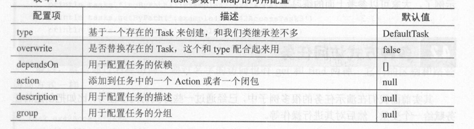

# 日志级别


`gradle-wrapper.properties`是由`Wrapper Task`生成的，所以在`build.gradle`中添加以下代码。
```
task wrapper(type: Wrapper) {
    gradleVersion = '2.4'
    distributionUrl = 'http\://services.gradle.org/distributions/gradle-2.4-all.zip'
}
```
# Grooy
> `<<` was deprecated in Gradle 4.x and removed in Gradle 5.0

`<<` for task definitions no longer works. In other words, you can not use the syntax

`task myTask << { …​ }`.
```gradle
task printStringClass {
	doLast {
		def str1 = '单引号'
		def str2 = "双引号"
		println str1 + str2
		println "双引号定义的字符串类型：${str1}"
		println '单引号定义的字符串类型：${str1}'
	}
}
```

## 集合

### List
```
task printList {
	doLast {
		def numList = [1,2,3,4,5]
		println numList.getClass().name
		println numList[1]//访问第2个元素
		println numList[2]//访问第3个元素
		println numList[-1]//访问最后一个元素
		println numList[-2]//访问倒数第二个元素
		println numList[1..3]//访问第二个到第四个元素
		numList.each{
			println it
		}
	}
}
```
运行得
```
: Executing task 'printList'...


> Task :printList
java.util.ArrayList
2
3
5
4
[2, 3, 4]
1
2
3
4
5

BUILD SUCCESSFUL in 85ms
1 actionable task: 1 executed
: Task execution finished 'printList'.
```
### Map
```
task printlnMap {
	doLast {
		def map1 = ['width':1024, 'height':768]
		println map1.getClass().name

		println map1['width']
		println map1.height

		map1.each {
			println "Key:${it.key}, Value:${it.value}"
		}
	}
}
```
结果
```
: Executing task 'printlnMap'...


> Task :printlnMap
java.util.LinkedHashMap
1024
768
Key:width, Value:1024
Key:height, Value:768

BUILD SUCCESSFUL in 99ms
1 actionable task: 1 executed
: Task execution finished 'printlnMap'.
```
### 方法

```
task invokeMethod {
	doLast {
		method(1, 2)
		method 1,2
		println "Max${method2(1, 2)}"
	}
}
def method(int a, int b) {
	println a + b
}
def method2(int a, int b) {
	if (a > b) {
		a
	} else {
		b
	}
}
```
结果
```
: Executing task 'invokeMethod'...

> Task :invokeMethod
3
3
Max2

BUILD SUCCESSFUL in 82ms
1 actionable task: 1 executed
: Task execution finished 'invokeMethod'.
```
括号可以省略的，

代码块可以作为参数传递
```
//呆板的写法其实是这样的
numList.each({println it})
//格式化
numList.each({
	println it
})
//好看一些，Groovy规定，如果方法的最后一个参数是闭包，可以放到方法外面
numList.each(){
	println it
}
//然后方法可以省略，就变成我们经常看到的样式
numList.each{
	println it
}
```
### javabean
```
task helloJavaBean {
	doLast {
		Person p = new Person()
		println "名字是：${p.name}"
		p.name = "张三"
		println "名字是：${p.name}"
		println "名字是：${p.age}"
	}
}
class Person {
	private String name
	public int getAge() {
		12
	}
}
```
结果
```
: Executing task 'helloJavaBean'...


> Task :helloJavaBean
名字是：null
名字是：张三

BUILD SUCCESSFUL in 113ms
1 actionable task: 1 executed
: Task execution finished 'helloJavaBean'.
```
在 Gradle 中你会见到很多这种写法，开始会以为这是该对象的一个属性，其实只是因为
该对象里定义了相应的 `get/setter` 方法而己。

## 闭包
闭包就是一段代码块
```
task helloClosure{
	doLast {
		customEach {
			println it
		}
		customEach {
			println "?"
		}
	}
}
def customEach(closure) {
	//模拟一个有10个元素的集合，开始迭代
	for (int i in 1..3) {
		closure(i)
	}
}
```
结果
```
: Executing task 'helloClosure'...

> Task :helloClosure
1
2
3
?
?
?

BUILD SUCCESSFUL in 114ms
1 actionable task: 1 executed
: Task execution finished 'helloClosure'.
```

向闭包传递参数
```
task helloClosure1 {
	doLast {
		eachMap {k, v ->
			println "${k},is ${v}"
		}
	}
}
def eachMap(closure) {
	def map1 = ["name":"张三", "age":"19"]
	map1.each {
		closure(it.key, it.value)
	}
}
```
因为传递了两个参数，所以要显式得声明出来。

```
: Executing task 'helloClosure1'...

> Task :helloClosure1
name,is 张三
age,is 19

BUILD SUCCESSFUL in 103ms
1 actionable task: 1 executed
: Task execution finished 'helloClosure1'.
```

闭包委托

Groovy支持闭包方法的委托。Groovy的闭包有thisObject、owner、delegate三个属性，当你在闭包内调用方法时，由他们来确定使用哪个对象来处理。默认情况下delegate和owner是相等的，但是delegate是可以被修改的，这个功能是非常强大的，Gradle中的闭包的很多功能都是通过修改delegate实现的。
```
task helloDelegate {
    new 
}
```


# 任务
## 创建
### 1
```
def Task ex41CreateTaskl = task(ex41CreateTaskl)
ex41CreateTaskl.doLast {
	println "创建方法的原型为：Task task(String name) throws"
}
```
接受一个name(任务名称)为参数，返回一个Task对象，在例子中把这个返回对象赋给一个Task类型的变量就可以操作。

### 2
```
def Task ex41CreateTask2 = task(ex41CreateTask2, group: BasePlugin.BUILD_GROUP)
ex41CreateTask2.doLast {
	println "创建方法的原型为：Task task(Map<String, ?> args, String name) throws InvalidUserDataException"
	println "任务分组：${ex41CreateTask2.group}"
}

```


### 3

```
task ex41CreateTask3 {
	description '演示任务创建'
	doLast {
		println "创建方法原型为：Task task(String name, Closure configureClosure)"
		println "任务描述：${description}"
	}
}
```

## 访问任务

### 1
